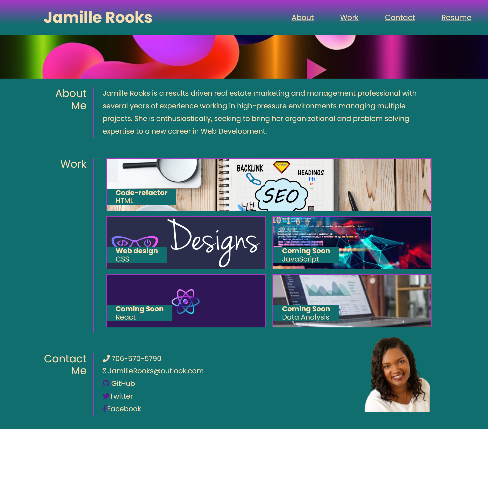

# first-portfolio
This is my first portfolio as a student in the Georgia Tech Coding Bootcamp.

# Description
The goal of this project is to showcase my Web Design, HTML and CSS skills to perspective employers.  <a href="https://jamillerooks.github.io/first-portfolio/" target="_blank">Link to Jamille Rooks First Portfolio</a>

# Mock-Up

# Contribution Guidelines
Your suggestions are welcome to help us achieve the goal of improved website accessibility and SEO ranking. 

We use Github and all it's built-in features to host the website, and to pull requests to the local repository.

Report all bugs to Github <a href="https://github.com/issues" target="_blank">issues</a> 

This website uses semantic HTML elements, and universal, element, and class selectors in CSS.

# License
All submissions to this project will fall under <a href="https://choosealicense.com/licenses/mit/"target="_blank">MIT License.</a>
